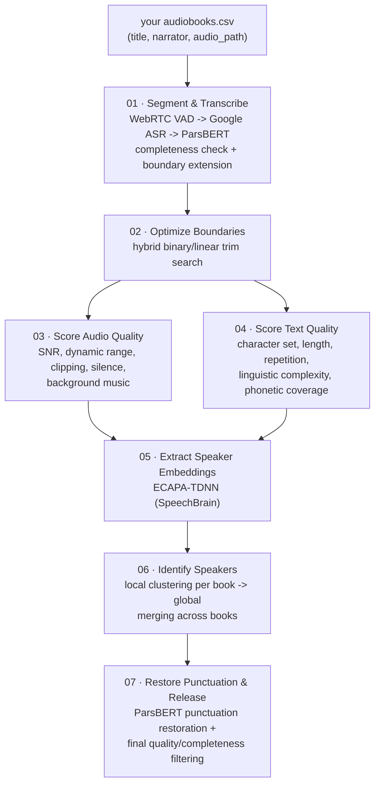

<div align="center">

# ParsVoice

### A Large-Scale Multi-Speaker Persian Speech Corpus for Text-to-Speech Synthesis

[](LICENSE)
[](requirements.txt)
[](#citation)

**2,200 hours** &nbsp;·&nbsp; **1.36M segments** &nbsp;·&nbsp; **1,815 speakers** &nbsp;·&nbsp; 25x larger than the previous largest open Persian TTS corpus

</div>

---

Persian is substantially underrepresented in open speech-text resources, which has held back progress in multi-speaker text-to-speech (TTS), speech-language modelling, and low-resource speech processing. **ParsVoice** is the largest publicly available Persian speech-text corpus built for multi-speaker TTS, along with the scalable pipeline used to construct it from long-form audiobook recordings — no reference transcripts required.

The pipeline combines a fine-tuned ParsBERT sentence-completion classifier, ASR-based boundary optimization, punctuation restoration, ECAPA-TDNN speaker identification, and a multi-dimensional quality assessment covering both audio and Persian-specific text properties. We validated the corpus by fine-tuning [XTTS](https://arxiv.org/abs/2406.04904) — a zero-shot multilingual TTS model that operates directly on raw Persian text, with no phoneme front-end — achieving a naturalness MOS of **3.6/5** and a speaker-similarity MOS of **4.0/5**.

This repository contains two things:

1. **The corpus construction pipeline** (`pipeline/`) — turns a folder of audiobooks you already have on disk into the final, release-ready ParsVoice dataset. It does not include XTTS fine-tuning code — the corpus is model-agnostic and works with any TTS architecture.
2. **Evaluation tooling** (`evaluation/`) — the Telegram-based subjective MOS/SMOS/intelligibility annotation bot ("Goyar"), plus objective multi-ASR WER/CER and ECAPA-TDNN speaker-similarity scripts, matching the paper's full evaluation (§5).

---

## Table of contents

- [Pipeline overview](#pipeline-overview)
- [Pipeline input format](#pipeline-input-format)
- [Repository structure](#repository-structure)
- [Installation](#installation)
- [Running the pipeline](#running-the-pipeline)
- [Evaluation](#evaluation)
- [Dataset statistics](#dataset-statistics)
- [TTS validation results](#tts-validation-results)
- [Pretrained models used by the pipeline](#pretrained-models-used-by-the-pipeline)
- [Notes on this release](#notes-on-this-release)
- [Citation](#citation)
- [License](#license)

## Pipeline overview

Starting from a CSV listing the audiobooks you have on disk, raw recordings are turned into TTS-ready (audio, transcript, speaker ID) triples in seven stages:



| Stage | Script | Paper section | What it does |
|---|---|---|---|
| 1 | [`01_segment_and_transcribe.py`](pipeline/01_segment_and_transcribe.py) | §3.2 Intelligent Audio Segmentation | Three-phase segmentation: WebRTC VAD boundaries -> Google ASR transcription -> ParsBERT sentence-completion check with iterative 0.1s boundary extension (up to 5s). |
| 2 | [`02_optimize_boundaries.py`](pipeline/02_optimize_boundaries.py) | §3.3 Boundary Optimization | Hybrid binary + linear search independently trims each segment's start/end to remove silence/artifacts while keeping the transcript character-for-character identical. |
| 3 | [`03_score_audio_quality.py`](pipeline/03_score_audio_quality.py) | §3.4.2 Audio Quality Metrics | 0–100 composite score from SNR, dynamic range, clipping, silence, duration, and background-music detection (inaSpeechSegmenter). |
| 4 | [`04_score_text_quality.py`](pipeline/04_score_text_quality.py) | §3.4.1 Persian Text Quality Metrics | 0–1 composite score from Persian-specific character validity, length, sentence structure, repetition, linguistic complexity, and phonetic coverage. |
| 5 | [`05_extract_speaker_embeddings.py`](pipeline/05_extract_speaker_embeddings.py) | §3.5 Speaker Identification | ECAPA-TDNN embeddings (SpeechBrain) for every segment. |
| 6 | [`06_identify_speakers.py`](pipeline/06_identify_speakers.py) | §3.5 / Appendix D | Two-stage speaker ID: local clustering per book (ensemble of Agglomerative/Spectral/GMM, confidence-scored) then global cross-book merging (cosine similarity >= 0.85, validated). |
| 7 | [`07_restore_punctuation.py`](pipeline/07_restore_punctuation.py) | §3.6 Final Cleaning & Release | Applies final audio/text quality + completeness + speaker-confidence filtering, restores punctuation with a ParsBERT token-classifier, writes the release manifest. |

Each script reads its input/output paths from environment variables (see [`pipeline/config.py`](pipeline/config.py)), with local `./data/...` defaults so the pipeline runs out of the box and scales to a real cluster by just pointing the env vars elsewhere.

## Pipeline input format

The pipeline does not fetch or download anything itself — point it at audiobooks you already have. Provide a CSV (default path `./data/audiobooks.csv`, override with `PARSVOICE_AUDIOBOOKS_CSV`) with three columns:

| Column | Description |
|---|---|
| `title` | Book title (used to derive an output folder name) |
| `narrator` | Narrator name, or blank/`unknown` if not known |
| `audio_path` | Path to a single audio file for the whole book, **or** a directory containing one audio file per chapter |

```csv
title,narrator,audio_path
گلستان سعدی,محمدرضا سرشار,/data/audiobooks/golestan_saadi/
سفر به گرای ۲۷۰ درجه,بهروز رضوی,/data/audiobooks/safar_270/whole_book.mp3
```

## Repository structure

```
ParsVoice/
├── pipeline/
│   ├── config.py                        # shared, env-var-driven path configuration
│   ├── 01_segment_and_transcribe.py
│   ├── 02_optimize_boundaries.py
│   ├── 03_score_audio_quality.py
│   ├── 04_score_text_quality.py
│   ├── 05_extract_speaker_embeddings.py
│   ├── 06_identify_speakers.py
│   └── 07_restore_punctuation.py
├── evaluation/
│   ├── goyar_mos_bot.py                  # Telegram MOS/SMOS/intelligibility annotation bot (subjective)
│   ├── calculate_wer_cer.py              # multi-ASR intelligibility eval: WER/CER (objective)
│   ├── calculate_speaker_similarity.py   # ECAPA-TDNN speaker-similarity eval (objective)
│   └── requirements.txt
├── requirements.txt
├── CITATION.cff
└── LICENSE
```

## Installation

```bash
git clone <this-repository-url>
cd ParsVoice

python3 -m venv .venv && source .venv/bin/activate
pip install -r requirements.txt

# pydub shells out to ffmpeg -- install it via your system package manager, e.g.:
#   macOS:  brew install ffmpeg
#   Ubuntu: sudo apt-get install ffmpeg
```

GPU (CUDA) is strongly recommended for stages 1, 5, and 7 (ParsBERT / ECAPA-TDNN / punctuation-restoration inference), and for reasonable throughput on stage 3 (inaSpeechSegmenter).

## Running the pipeline

All configuration is via environment variables read by `pipeline/config.py` (each has a working local default under `./data/`). Put your audiobooks CSV at `./data/audiobooks.csv` (or set `PARSVOICE_AUDIOBOOKS_CSV`), then run stages in order from the repository root:

```bash
export PARSVOICE_DATA_ROOT=./data   # or point this at a large disk / mounted volume

python pipeline/01_segment_and_transcribe.py --test         # small subset, for a smoke test
python pipeline/02_optimize_boundaries.py
python pipeline/03_score_audio_quality.py
python pipeline/04_score_text_quality.py
python pipeline/05_extract_speaker_embeddings.py --test     # 3 books, 10 files each
python pipeline/06_identify_speakers.py all
python pipeline/07_restore_punctuation.py
```

Drop `--test` to run over your full audiobook catalog. Every stage is checkpointed, so a killed or crashed run resumes automatically from where it left off — just re-run the same command.

The two ParsBERT models the pipeline calls out to (sentence-completion classification in stage 1, punctuation restoration in stage 7) are pretrained artifacts, not trained by this repository — point `PARSVOICE_COMPLETION_MODEL_PATH` / `PARSVOICE_PUNCTUATION_MODEL_PATH` at your own checkpoint or a Hugging Face Hub model id (see [`pipeline/config.py`](pipeline/config.py)).

## Evaluation

All three tools in `evaluation/` consume the same samples CSV — one row per (reference recording, synthesized clip) pair, with `transcript`, `reference_audio`, `generated_audio` columns (optionally `speaker_id`, `Gender`/`speaker_gender`, `age`/`speaker_age`, `accent`, `speaker_type`). This mirrors the paper's setup: 90 synthesized samples from 42 unseen Persian Common Voice reference speakers (§5.2).

```bash
pip install -r evaluation/requirements.txt
```

### Subjective: MOS/SMOS/intelligibility bot (Goyar)

`goyar_mos_bot.py` is the Telegram bot used to collect the subjective ratings reported in the paper (§5, Appendix "Annotation Interface and Procedure"). For each item, a rater listens to the reference speaker's recording, then the synthesized clip, and rates it on three criteria via inline buttons:

- **Naturalness (MOS, 1–5)** — does it sound robotic, or human?
- **Speaker similarity (SMOS, 1–5)** — does it sound like the reference speaker?
- **Intelligibility (1–5, 0.5 increments)** — does the audio match the written text?

Every rating is written to disk immediately, and a rater's position is checkpointed so they can close Telegram and resume later.

```bash
export GOYAR_BOT_TOKEN=...              # from @BotFather -- required
export GOYAR_SAMPLES_CSV=samples.csv

python evaluation/goyar_mos_bot.py
```

Results land in `MOS.csv` (one row per rating) and `USERS.csv` (rater demographics), both configurable via `GOYAR_MOS_RESULTS_CSV` / `GOYAR_USERS_CSV`.

### Objective: multi-ASR WER/CER (intelligibility)

`calculate_wer_cer.py` transcribes each synthesized clip and computes Persian-normalized WER/CER against the ground-truth transcript (paper §5.4, Table `tab:wer_multiASR`). Two interchangeable engines:

```bash
# Google Web Speech (free, no model download -- matches the paper's "Google ASR" row)
python evaluation/calculate_wer_cer.py --engine google --samples-csv samples.csv

# Any Hugging Face ASR checkpoint (matches the paper's "Whisper fine-tuned" row;
# swap --model for any other seq2seq ASR checkpoint)
python evaluation/calculate_wer_cer.py --engine hf --model your-org/whisper-persian-finetuned \
    --samples-csv samples.csv --output wer_cer_whisper.csv
```

Run it once per ASR system you want to report (the paper uses three: Google ASR, a Persian-finetuned Whisper, and Qwen ASR) and, for the TTS-vs-real-speech gap, once more against a real-speech reference set such as Google FLEURS Persian.

### Objective: speaker similarity (ECAPA-TDNN)

`calculate_speaker_similarity.py` computes cosine similarity between reference and generated speaker embeddings using the same ECAPA-TDNN model as pipeline stage 5 (paper §5.4):

```bash
python evaluation/calculate_speaker_similarity.py --samples-csv samples.csv
# or score a single pair:
python evaluation/calculate_speaker_similarity.py --pair reference.wav generated.wav
```

Writes `speaker_similarity_scores.csv` plus a console summary (mean/median, quality-tier breakdown, and a by-gender/by-age split if those columns are present).

## Dataset statistics

| Stage | Segments | Hours |
|---|---:|---:|
| VAD output | 5,161,459 | 5,824.7 |
| After removing empty transcripts | 3,323,679 | 5,127.3 |
| After boundary optimization | 2,999,296 | 4,096.2 |
| After audio/text quality filtering | 2,089,749 | 3,007.8 |
| **Final TTS-ready subset** | **1,364,671** | **2,199.7** |

|  | ASR-oriented subset | Final TTS subset |
|---|---:|---:|
| Total hours | 4,096.2 | 2,199.7 |
| Segments | 2,999,296 | 1,364,671 |
| Total tokens (hazm) | 29,566,314 | 17,347,614 |
| Unique word forms | 309,406 | 229,860 |
| Speakers | — | 1,815 |
| Books | 2,231 processed | 1,706 retained |

## TTS validation results

We fine-tuned XTTSv2's GPT component on ParsVoice (frozen DVAE, 2,500 added Persian BPE tokens) and evaluated 90 synthesized samples against 42 unseen Persian Common Voice reference speakers, rated by 22 native Persian raters via the Goyar bot above.

| System | MOS (naturalness) | SMOS (speaker similarity) | Intelligibility MOS |
|---|:---:|:---:|:---:|
| Real Persian speech† | 4.72 | 4.86 | — |
| **XTTS + ParsVoice** | **3.59 ± 0.09** | **4.03 ± 0.08** | **4.03 ± 0.08** |

† Reference values from prior work, included as an approximate upper bound; not directly comparable (different raters/protocol). See the paper (§5) for the full multi-ASR intelligibility evaluation (WER/CER) and objective speaker-similarity results.

## Pretrained models used by the pipeline

| Model | Used in | Source |
|---|---|---|
| Sentence-completion classifier (ParsBERT) | Stage 1 | Fine-tuned from [ParsBERT](https://github.com/hooshvare/parsbert) on PersianPunc truncation-augmented data (Appendix C); citation omitted for anonymous review |
| Punctuation restoration (ParsBERT) | Stage 7 | PersianPunc; citation omitted for anonymous review |
| Speaker embeddings (ECAPA-TDNN) | Stage 5 | [`speechbrain/spkrec-ecapa-voxceleb`](https://huggingface.co/speechbrain/spkrec-ecapa-voxceleb) |
| ASR (transcription) | Stages 1–2 | Google Web Speech API via [`SpeechRecognition`](https://github.com/Uberi/speech_recognition) (swappable — see §3.2 of the paper) |

## Notes on this release

- XTTS training/evaluation is out of scope — this repo is the corpus-construction pipeline and evaluation tooling only, and works with any TTS architecture.
- The pipeline takes a local CSV of audiobooks as input rather than any specific scraper or cloud-storage integration.
- Every filtering/scoring threshold (VAD sensitivity, audio and text quality cutoffs, speaker-similarity thresholds, trim/extension step sizes, etc.) is a plain, named constant at the top of its stage script — tune them directly for your own data.

## Citation

If you use ParsVoice or this pipeline, please cite:

```bibtex
@inproceedings{anonymous2026parsvoice,
  title     = {ParsVoice: A Large-Scale Multi-Speaker Persian Speech Corpus for Text-to-Speech Synthesis},
  author    = {Anonymous},
  year      = {2026},
  note      = {Under double-blind review}
}
```

*(Author list redacted for double-blind review; full citation will be provided upon acceptance.)*

## License

Code in this repository is released under the [MIT License](LICENSE). The ParsVoice corpus itself is released separately (see the paper for release details); dataset licensing terms are governed by that release, not by this code license.
